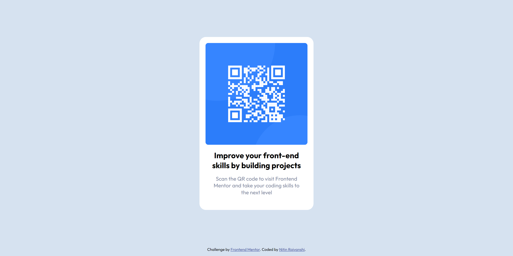
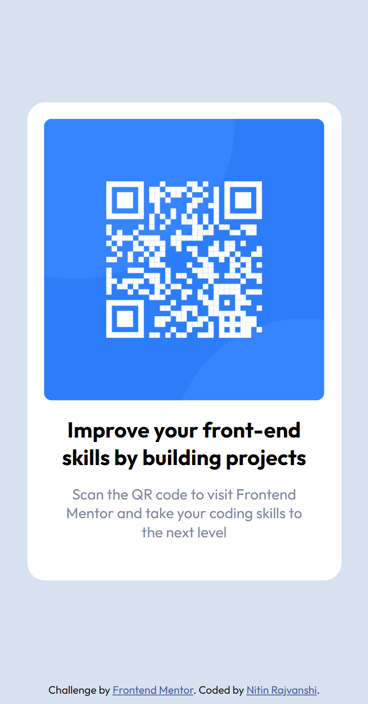

# Frontend Mentor - QR code component solution

This is a solution to the [QR code component challenge on Frontend Mentor](https://www.frontendmentor.io/challenges/qr-code-component-iux_sIO_H). Frontend Mentor challenges help you improve your coding skills by building realistic projects. 

## Table of contents

- [Overview](#overview)
  - [Screenshot](#screenshot)
  - [Links](#links)
- [My process](#my-process)
  - [Built with](#built-with)
  - [What I learned](#what-i-learned)
  - [Continued development](#continued-development)
  - [Useful resources](#useful-resources)
- [Author](#author)

## Overview

### Screenshot

### Links

- Solution URL: [Solution URL](https://www.frontendmentor.io/solutions/qr-code-component-rJgD5Fe4c)
- Live Site URL: [Live site URL](https://nkraj7266.github.io/FrontendMentor_Project1/)

## My process

### Built with

- Semantic HTML5 markup
- CSS custom properties
- Flexbox

### What I learned

  Learned CSS flex properties for the first time while working for this project.
  And since this was my first time so I tried to give my best so that the site looks the same as it was shown in the screenshot, which took me time but I learned new things by doing this porject.

### Continued development

  Still I'm not good at CSS Advanced properties so lookking further improvement in learning these by doing more projects.
  And also started learning JS and Bootstarp.

### Useful resources

- [Resource 1](https://www.youtube.com/watch?v=5qVuORLniwM&t=1383s) - This video from the youtube channel "Code with Harry" helped me for learning CSS Flexbox. I really liked his content.

## Author

- Website - [Nitin Rajvanshi](https://www.your-site.com)
- Frontend Mentor - [@nkraj7266](https://www.frontendmentor.io/profile/nkraj7266)
- Twitter - [@nitinrajvanshi4](https://www.twitter.com/nitinrajvanshi4)
